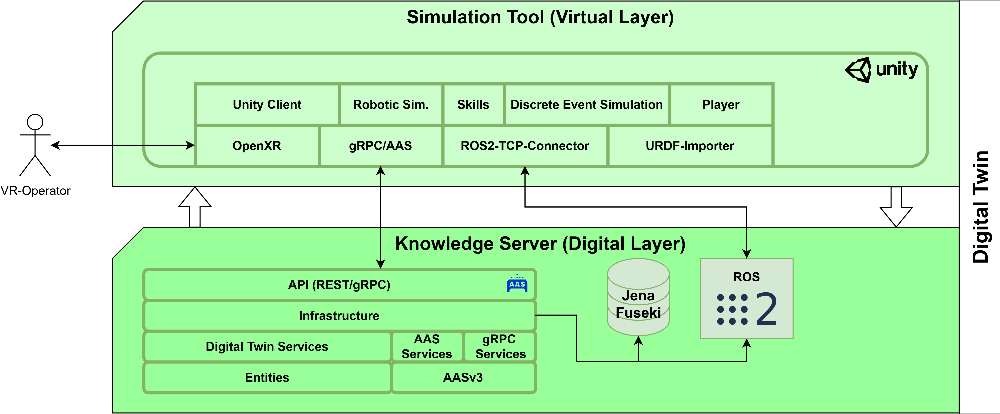

# FSRDigitalTwin3D
FSRDigitalTwin3D is a prototype for a simulation environment aimed at the virtual validation of robots, in particular robots with social-cognitive abilities, meaning it aims to simulate use cases with human-robot-interaction in production and healthcare. The design philosophy is to provide a "playground" for virtual robotics simulations while being as simplistic as possible and abiding to the standards for modern Industry 4.0 applications.

**Note:** This framework is developed as a sub-project for the research association FORSocialRobots, namely "Subproject 4: Simulation and validation of socially cognitive robots in the digital twin"

## Requirements
This project has OS support for Linux and Windows.

- .NET 8.*
- Unity 2022.3.8f1

## Installation
### Unity Client (Virtual Layer)
The client is located at ```/FSR/DigitalTwin/Client/Unity/FSR.DigitalTwin.Client/```:

1. Navigate to folder ```/FSR/Tools/```
2. Run script ```install-client-plugins```
3. Load Git submodules ```git submodule update --init --recursive```
4. Import the Unity project into Unity Hub and open

### Digital Twin Server (Digital Layer)
The server solution is located at ```/FSR/DigitalTwin/Server/FSR.DigitalTwin.sln```

1. Navigate to folder ```/FSR/Tools/```
2. Run script ```install-tools```
3. Load Git submodules ```git submodule update --init --recursive```

### Infrastructure
Additional infrastructure may be required depending on what you want to do. The following lists a set of addititonal services that can be enabled within the *digital layer*. The most prominent example would be our ROS2 Humble workspace.

#### ROS2 Humble COLCON workspace
The ROS2 Humble workspace is located in ```/FSR/ROS/```. We recommend setting up a Docker image with ROS2 Humble. Installing ROS2 locally is pretty unpleasant after all!

1. In your Docker image with ROS2 Humble, run ```export COLCON_WS=<path/to/repo>/FSR/DigitalTwin/Server/modules/Ros2Ws/```
2. Navigate to the COLCON workspace ```cd $COLCON_WS```
3. Run ```vcs import src --skip-existing --input src/Universal_Robots_ROS2_Driver/Universal_Robots_ROS2_Driver.humble.repos```
4. Run ```rosdep install --ignore-src --from-paths src -y -r```
5. Run ```colcon build --cmake-args -DCMAKE_BUILD_TYPE=Release```
6. Lastly, source the installation ```source install/setup.sh```

The digital twin maintains a connection to the ROS2 workspace through its infrastructure sub-layer.

#### Data Backbone
The Digital Twin consists of a data backbone, essentially a collection of databases specialized towards a specific type of information. Since we have a 90s-Linux-Mentality, open-source third party infrastructure modules are included and built from source.

##### Semantic Data Repository (Apache Jena)
The semantic data repository is realized through [Apache Jena](https://github.com/apache/jena) querying a knowledge graph through a Fuseki Server. If you want to include or implement services for semantic reasoning, you need to either install Apache Jena Fuseki, or build it from source. 

Building from source:

1. Ensure the Jena source is located at ```/FSR/DigitalTwin/Server/modules/Jena/```
2. If missing, load Git submodules ```git submodule update --init --recursive```
3. Navigate to folder ```/FSR/DigitalTwin/Server/tools/LaunchJenaFuseki/``` and run script ```build-jena-fuseki```
4. Launch Jena by either building the project ```LaunchJenaFuseki``` or running the scripts ```build-jena-fuseki```

## The Framework



FSRDigitalTwin3D is split into three main layers:

### Digital Layer
The digital layer (essentially the digital twin's connection layer) is implemented as a .NET server that manages connections and services maintaining a semantic description about the provided use case combined with an Industry 4.0 standardised API for data exchange. Currently, the Asset Administration Shell V3.0 (AAS) is used to provide these services.

The internal architecture of the server follows the ["Clean Architecture"](https://betterprogramming.pub/the-clean-architecture-beginners-guide-e4b7058c1165) design pattern:

- *Domain*: Contains the digital twin entities like the AASv3 models
- *App*: Implements app services (AASX services)
- *Infra*: Responsible for communication with external modules and the physical assets
- *API*: Provides the AASv3/REST-API as well as a digital twin specific gRPC-API for DT-interal communication (digital layer <\-\> virtual layer)

### Virtual Layer
The virtual layer acts as the use case's virtualization environment. It mirrors and visualizes the physical counterpart and provides a UI for user interaction. Up to this point, the virtual layer is implemented through a client using the Unity Engine as simulation environment.

- *gRPC/AAS*: The gRPC/AAS-based digital workspace provides a connection to the digital twin's semantic representation of a given use case and its entities and processes implementing the interface ```IDigitalWorkspace``` in the process. This interface acts as a hub for bidirectional communication between the digital and virtual layer.
- *ROS2-TCP-Connector*: Provides an addititonal connection to the ROS2 workspace
- *VR layer*: Allows a VR-Operator to interact with the virtual scene
- *Virtual workspace*: Contains all actors, robots, behaviors, sensors, simulation models etc. within the simulation environment

### Physical Layer
The physical layer is the set of supported physical assets of a given use case connected and digitized within the digital twin.

- *UR5e*: The system supports a UR5e cobot, which is digitized in the digital layer and simulated in the virtual layer
- *Human Operator*: The human operator is also part of the physical layer. Technically, she/he can also interact with the virtualization layer as a VR-Operator, but we are not fussy...
- *Physical Sensor*: The set of physical sensors sending data to the digital twin.

## Contributing

We are always happy about contributions! Feel free to suggest improvements or highlight mistakes in GitHub's issues section.

**Note**: This project is maintained by the [Chair of Digital Manufacturing](https://www.uni-augsburg.de/de/fakultaet/fai/informatik/prof/pi/) of the University of Augsburg.

**Note**: If you have questions or suggestions that are not suitable for discussion within the issues section, feel free to send an e-mail to raoul.zebisch@uni-a.de.

**Licence**: MIT

